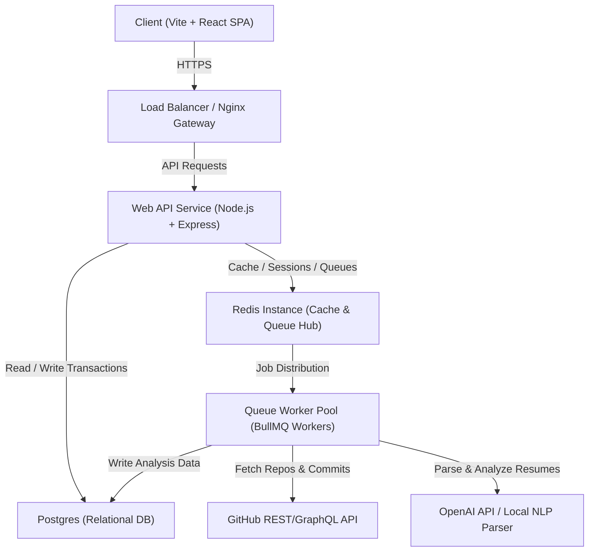
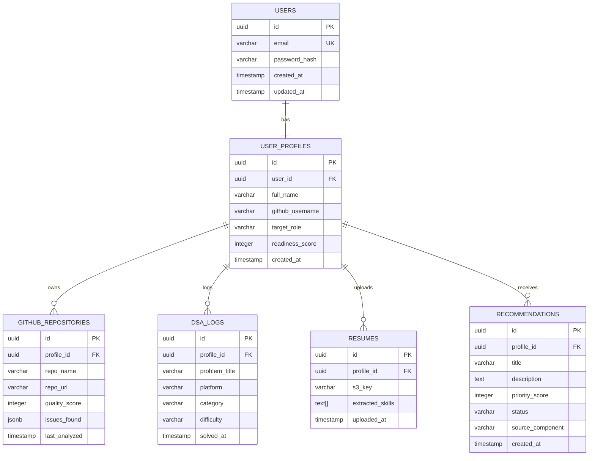

# Nexora: Architecture Overview

This document provides a comprehensive overview of the technical architecture, database design, security strategy, and deployment topology of the Nexora platform.

---

## High-Level Architecture

Nexora utilizes a decoupled, modern three-tier web architecture. The front end is a single-page application (SPA) serving client-side UI, while the backend leverages a modular REST API linked with a multi-tenant asynchronous worker pool for compute-heavy background tasks (such as static analysis of repositories and PDF parsing).

---

## Backend Architecture

The backend is organized as a layered monolith in the early phases, ready to separate into microservices (API Service and Worker Service) as scale demands.

1.  **API Service (REST Endpoint Hub)**
    *   **Technology**: Node.js, TypeScript, Express.
    *   **Responsibilities**: Request routing, input schema validation (using Zod), authentication middleware, session state handling, and fast database queries.
    *   **Pattern**: Controller-Service-Repository pattern.
        *   *Controllers*: Handle HTTP translation and validate request bodies.
        *   *Services*: Enforce business rules, check system states, and initiate background queue events.
        *   *Repositories*: Interface directly with database queries via Prisma (ORM) or raw SQL.
2.  **Worker Service (Asynchronous Core)**
    *   **Technology**: Node.js, TypeScript, BullMQ.
    *   **Responsibilities**: Runs CPU-bound operations asynchronously to avoid blocking the HTTP event loop.
    *   **Key Workers**:
        *   `GitHubScraperWorker`: Interacts with GitHub APIs to pull repo structures, parsing directory trees and file metadata.
        *   `ResumeParserWorker`: Handles file chunk extraction, processes raw text, and sends prompts to structured parsing tools (e.g., OpenAI JSON Schema endpoints) to retrieve standardized skills.
        *   `InsightEngineWorker`: Inspects code files looking for target files (`jest.config.js`, `.gitignore`, `tsconfig.json`) or security anomalies.

---

## Frontend Architecture

The frontend is built to load instantly, feel responsive, and handle real-time UI state updates.

*   **Core Engine**: Vite + React + TypeScript.
*   **Styling System**: Vanilla CSS Variables built on an HSL design system. TailwindCSS configuration can be layered if design demands shift.
*   **State Management**:
    *   *Global State*: Zustand (for lightweight auth profiles, theme settings, active repository tracking).
    *   *Server Cache State*: TanStack Query (React Query) for fetching, caching, and synchronizing network responses.
*   **Routing**: React Router DOM (supports path-based routing, private/auth-guarded routes, and lazy-loaded modules).

---

## Database Overview

Nexora stores transactional relational data in PostgreSQL. Redis is used as an ephemeral cache, session state engine, and BullMQ task orchestrator.

### PostgreSQL Relational Schema

### Redis Usage Strategy
*   **API Rate Limiting**: Tracking request thresholds by IP and Token.
*   **OAuth Sessions**: Storing transient OAuth login state handshake keys.
*   **Task Queues**: Acting as the message-broker engine for BullMQ queue channels (`github-sync`, `resume-parse`, `insight-run`).

---

## Module Breakdown

1.  **Auth Module**: Manages logins, signups, JWT validation, and OAuth key handshakes.
2.  **User Profile Module**: Tracks student progress, aggregates general statistics, and handles target career preference updates.
3.  **GitHub Module**: Integrates with the GitHub API, retrieves file contents, handles repository polling, and calculates active project metadata.
4.  **Resume Module**: Handles binary file uploads, extracts plain text, and runs NLP classification pipelines.
5.  **DSA Tracker Module**: Manages logged questions, provides topic taxonomies, and processes LeetCode profile integrations.
6.  **Insight & Quality Engine**: Analyzes codebase patterns for testing presence, security oversights, and packaging quality.
7.  **Recommendation Engine**: Synthesizes output from all modules, runs the scoring rubric, and maintains the active, sorted recommendation lists.

---

## Security Strategy

*   **OAuth Secure Flow**: Integrates authorization-code flows with short-lived access keys and secure, encrypted OAuth tokens stored in the database.
*   **JWT Integrity**: Authentication tokens are signed with HMAC-SHA256. Access tokens are stored short-term in memory, while refresh tokens are persisted in `HttpOnly, Secure, SameSite=Strict` cookies.
*   **Input Sanitization & Schema Validation**: Strict input boundary validation via Zod schemas to block SQL injection and Cross-Site Scripting (XSS) vectors.
*   **Secret Protection**: Backend uses static AST pattern searches (e.g., regex checks for AWS keys, private credentials, or high-risk configurations) to verify candidates aren't exposing credentials within synchronized repositories.

---

## Scalability Considerations

*   **Horizontal API Scaling**: The Web API Service runs stateless within containers behind a load balancer, allowing horizontal scaling as request counts climb.
*   **Independent Worker Scaling**: Queue workers scale independently from the API server. We can increase worker replicas during heavy processing periods (e.g., bootcamp graduation seasons) without over-provisioning web server memory.
*   **Query Caching**: Heavy queries (such as system dashboards or cumulative progress metrics) are cached in Redis for up to 15 minutes, lowering pressure on the primary database.
*   **Database Read Replicas**: If read queries scale significantly, database traffic splits between a single primary writer and multiple read replicas.

---

## Deployment Strategy

Nexora utilizes containerized deployments managed via Docker and automated CI/CD pipelines.

*   **Development / Staging Setup**: Uses standard Docker Compose files mapping PostgreSQL, Redis, Frontend, and Backend instances together inside a shared local network.
*   **Production Platform**:
    *   **Frontend**: Built as static HTML/JS assets and deployed to high-performance Edge CDN networks (such as Vercel, Netlify, or AWS CloudFront/S3).
    *   **Backend & Workers**: Containerized using multi-stage Dockerfiles and deployed onto Amazon ECS (Elastic Container Service) or Kubernetes (EKS).
    *   **CI/CD Pipeline**: GitHub Actions automates the build, test, and deploy flow:
        1. Run unit and integration testing suites.
        2. Lint check syntax rules.
        3. Build optimized Docker images.
        4. Push images to Amazon ECR (Elastic Container Registry).
        5. Trigger automated rollouts on target cluster servers.
